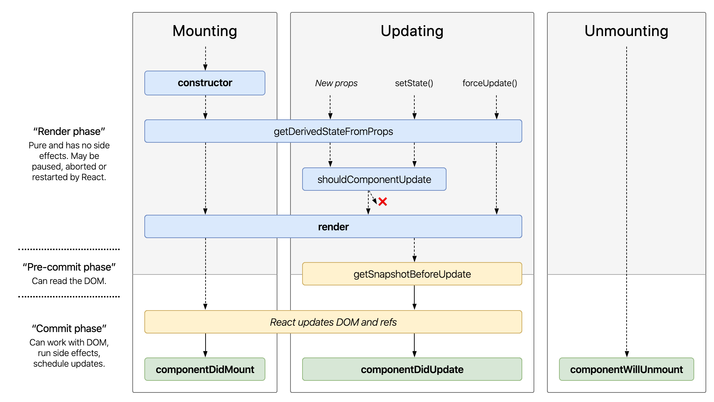

import { Head, Image, Appear } from 'mdx-deck'
import { Split, FullScreenCode } from 'mdx-deck/layouts'
import { CodeSurfer } from "mdx-deck-code-surfer";

import { Cover } from './Cover';
import { Intro } from './Intro';
import { Img } from './Img';
import { InlineImg } from './InlineImg';
import { Thanks } from './Thanks';
import { Feedback } from './Feedback';

export { default as theme } from './theme'

<Head>
  <title>Practical Hooks, Redux Hooks and Fast Refresh</title>
</Head>

<Cover />

---

<Intro />

---

## Overview

<ul>
    <Appear>
        <li>
            React Components
        </li>
        <li>
          Primitive Hooks
        </li>
        <li>
          Redux Hooks
        </li>
        <li>
          Fast Refresh
        </li>
    </Appear>
</ul>

---

### React Components

---

### React Components

- Declarative
- Encapsulate state
- Composable

---

### Declarative

- Declare how your view will look like
- React will update DOM or another host tree

---

### Encapsulate State

- Each component can manage their own state

---

### Composable

- You can compose components to create complex UIs

---

## React Components

---

### Props

- Properties to modify a component
- Read only, can't be modified

---

### State

- Something that will change in the scope of the component

---

## React Components

---

### Effects

- Side effect created by a component

---

### Component Dichotomy

- It acts as a pure function in some cases
- It acts as a stateful logics in some cases
- It can cause side effects in some cases

---

### Component Dichotomy

- classes was used to represent stateful logic
- functions was used to represent pure logics

---

### React Hooks

- Bring stateful logic and side effects to functions components
- it is all about co-location
- Compose state and effects

---

### Before Hooks

---

### After Hooks

---

### Hooks Gif

---

# Primitive Hooks

---

### Rules of Hooks

- Only Call Hooks at the Top Level (Don’t call Hooks inside loops, conditions, or nested functions)
- Only Call Hooks from React Functions

---

### useState

---

### useState

- Declares a value that will be managed by this component

---

### old style setState

---

### useContext

---

### useContext

- reads a context value on render
- it will be rerendered when context value changes

---

### old style contextType class

---

### Component Lifecycle

---

### Component Lifecycle (Full)

---

### useEffect

- replaces the use of component lifecycles
- let you hook in commit phase

---

### useEffect - examples

- data fetching (use suspense approach instead)
- subscriptions
- manually changing the DOM

---

### Effect without cleanup (lifecycle)

---

### Effect without cleanup (useEffect)

---

### Effect with cleanup (lifecycle)

---

### Effect with cleanup (useEffect)

---

### useReducer

---

### useCallback

### useMemo

### useRef

## useLayoutEffect

## useImperativeHandle

## useDebugValue

## Redux

## useSelector -> mapStateToProps
- extract data from redux store

## reselect (memoize selector)

## useDispatch - used to dispatch actions to redux store

## useStore - return the store passed to Provider

## Fast Refresh

- deep dive in fast refresh structure (how it works?)
- why is it different from react hot loader? (hmr)

### What's Next?

---

## References

- [Reactjs Docs](https://reactjs.org/docs/)
- [Redux Docs](https://react-redux.js.org/next/api/hooks)
- [threepointone tweet about hooks](https://twitter.com/threepointone/status/1056594421079261185)
- [gif hooks tweet](https://twitter.com/prchdk/status/1056960391543062528)

---

<Thanks />

---

<Feedback />
